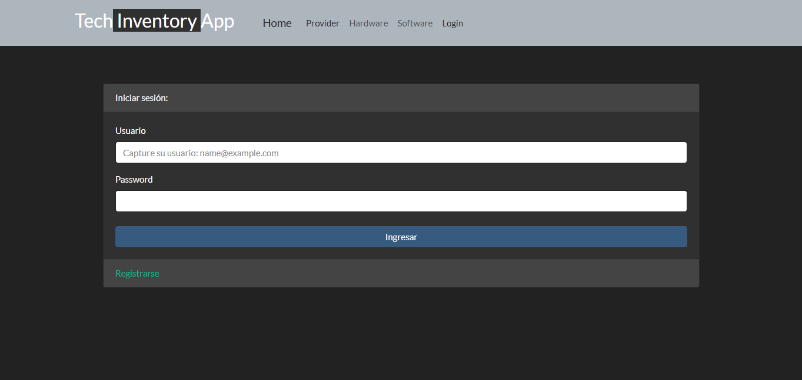

# Tech-Inventory-App

## Descripción de la aplicación

* Aplicación que permite realizar el registro de datos generales de hardware y software para el control de un inventario.
* La aplicación cuenta con las opciones de Provider, Hardware, Software, Login y Logout.
* La opción de provider realiza el CRUD del catálogo de proveedores
* En las opciones Hardware y Software se realiza el CRUD de los catálogos del inventario.
* Las opciones Login/Logout son los responsables del registro de usuario y el control de acceso a la plataforma
* Es necesario registrarse e iniciar sesión para poder ingresar.

## Aplicación desplegada en Heroku
* https://la_gran_aplicacion.herokuapp.com/

## Captura de pantalla de la aplicación

## Animación de la aplicación

## Tecnologías utilizadas

* [bcrypt-5.1.0](https://www.npmjs.com/package/bcrypt "bcrypt-5.1.0")

* [connect-session-sequelize-7.1.5](https://www.npmjs.com/package/connect-session-sequelize "connect-session-sequelize-7.1.5")

* [dotenv-16.0.3](https://www.npmjs.com/package/dotenv "dotenv-16.0.3")

* [express-4.18.2](https://www.npmjs.com/package/express "express-4.18.2")

* [express-handlebars-6.0.6](https://www.npmjs.com/package/express-handlebars "express-handlebars-6.0.6")

* [express-session-handlebars-1.17.3](https://www.npmjs.com/package/express-session "express-session-handlebars-1.17.3")

* [mysql2-2.2.5](https://www.npmjs.com/package/mysql2 "mysql2-2.2.5")

* [sequelize-6.26.0](https://www.npmjs.com/package/sequelize "sequelize-6.26.0")

* [morgan-1.10.0](https://www.npmjs.com/package/morgan "morgan-1.10.0")

## Autores

- [Doris Recio](https://github.com/dorecio)
- [Carlos Ortiz](https://github.com/carlosgortiz)
- [Davi Morales](https://github.com/Davidmome)
- [Julio César Del Ángel](https://github.com/JulioCesarDelAngel)
